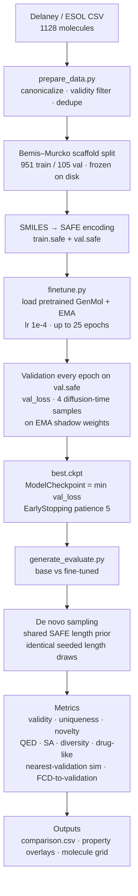
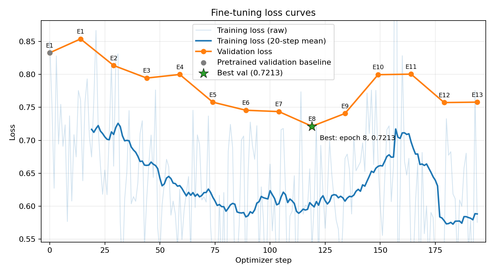
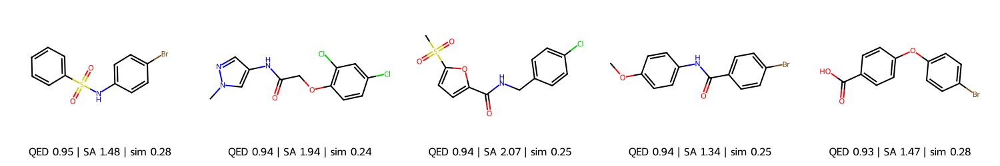
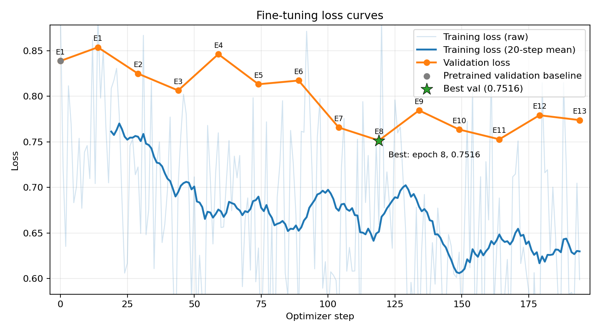
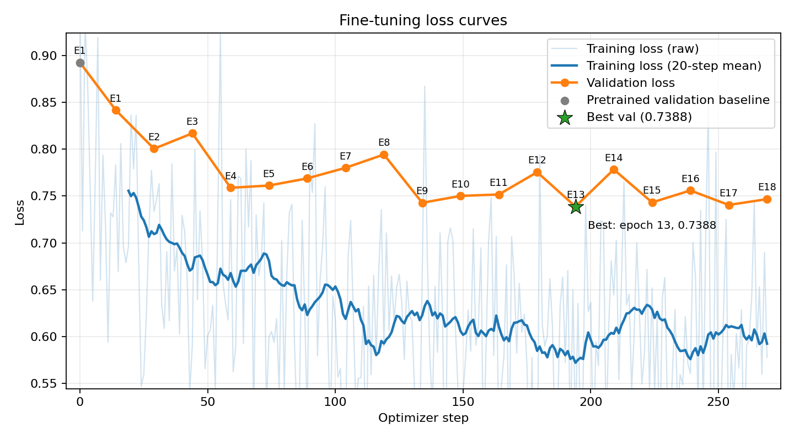

# GenMol Fine-tuning PoC — Small Molecule Design

Fine-tune the pretrained **NVIDIA GenMol** discrete-diffusion model on a focused small-molecule
dataset (**Delaney / ESOL**) and evaluate whether the fine-tuned model generates **valid, novel,
drug-like** molecules aligned to the target chemical domain. Designed to run on **one A100 GPU via Slurm**.

GenMol is a masked discrete-diffusion model over **SAFE** molecular sequences with a BERT
backbone. Fine-tuning continues from the pretrained backbone and EMA with a lower learning rate,
short warmup, and reset EMA history so generation weights can track a short domain adaptation run.

## Index

- [1. Project overview](#1-project-overview)
  - [Assignment and deliverables](#assignment-and-deliverables)
  - [Pipeline and design decisions](#pipeline-and-design-decisions)
  - [Dataset](#dataset)
  - [Repository layout](#repository-layout)
- [2. Setup](#2-setup)
  - [Get the code and data](#get-the-code-and-data)
  - [Create the environment](#create-the-environment)
  - [Download a pretrained checkpoint](#download-a-pretrained-checkpoint)
- [3. Run the pipeline](#3-run-the-pipeline)
  - [Slurm batch (recommended)](#slurm-batch-recommended)
  - [Interactive allocation](#interactive-allocation)
  - [Manual stage-by-stage run](#manual-stage-by-stage-run)
  - [Optional hyperparameter sweep](#optional-hyperparameter-sweep)
- [4. Evaluation framework](#4-evaluation-framework)
  - [Success criteria](#success-criteria)
  - [Limitations](#limitations)
  - [Recommended next steps](#recommended-next-steps)
- [5. Run management](#5-run-management)
  - [Experiment tracking](#experiment-tracking)
  - [Reproducibility](#reproducibility)
  - [GenMol V1 vs V2](#genmol-v1-vs-v2)
- [6. Experiments and results](#6-experiments-and-results)
  - [Train-validation split](#train-validation-split)
  - [Experiment 1: full fine-tuning](#experiment-1-full-fine-tuning)
  - [Experiment 2: lower learning rate](#experiment-2-lower-learning-rate)
  - [Experiment 3: frozen layers](#experiment-3-frozen-layers)
  - [Comparison and conclusion](#comparison-and-conclusion)
- [7. Reference](#7-reference)
  - [Metric definitions](#metric-definitions)
  - [Known upstream issues](#known-upstream-issues)

## 1. Project overview

### Assignment and deliverables

**Task:** Small Molecule Design

**Reference:** [NVIDIA GenMol](https://github.com/NVIDIA-BioNeMo/genmol)

**Scenario:** Develop a proof of concept (PoC) for a customer with the requirements below.
The solution will be evaluated against these same requirements.

**Data:** [Delaney / ESOL dataset from DeepChem](https://github.com/deepchem/deepchem/blob/master/datasets/delaney-processed.csv)

**Objective:** Fine-tune the pretrained NVIDIA GenMol model on a focused small-molecule dataset
and evaluate whether the fine-tuned model generates valid, novel, drug-like molecules aligned
to the chosen chemical domain.

**Compute requirement:** The work must run on **one A100 GPU managed through Slurm**.

**Deliverables:**

- Source code and environment setup instructions.
- Slurm submission script.
- Data-preparation script and dataset description.
- A small presentation covering dataset and preprocessing, fine-tuning configuration,
  quantitative comparison of the base and fine-tuned models, five example generated molecules
  with SMILES, QED, SA score and similarity score, limitations, and recommended next steps.

**Evaluation emphasis:** The focus is on the **approach**, rather than accuracy alone.

### Pipeline and design decisions

The whole fine-tuning pipeline is three seeded stages — **prepare → fine-tune → generate/evaluate** —
that every run method (Slurm, interactive, or manual) executes identically:



**What matters at each stage:**

- **Frozen, scaffold-disjoint split** — val holds scaffolds unseen in train, and the split is written
  once and reused, so fine-tuning and evaluation never disagree on train/val.
- **Validation is real, not cosmetic** — `val.safe` is scored every epoch; each `val_loss` averages
  **4 independent diffusion-time samples** to cut Monte Carlo noise in checkpoint selection.
- **Selection = `best.ckpt`** — the minimum-`val_loss` snapshot is saved and used downstream; when EMA
  is on, validation and generation evaluate the **same EMA weights**.
- **Controlled sampling** — base and fine-tuned models draw from the **same seeded SAFE length prior**,
  so metric differences reflect *token predictions*, not a size confound.
- **Distribution-shift evaluation** — beyond validity/QED/SA, we report **novelty, diversity,
  nearest-validation Tanimoto, and FCD to the scaffold-held-out validation distribution** to
  measure movement toward the target domain.

#### What this PoC adds beyond the brief

The brief asked for a fine-tuning run, Slurm scripts, data preparation, and a presentation. This
PoC also includes:

- **Scaffold-disjoint validation:** a Bemis-Murcko split keeps validation scaffolds out of training;
  `--split random` remains available as a fallback.
- **Reliable checkpoint selection:** validation runs every epoch, averages multiple diffusion-time
  samples, and saves the lowest-`val_loss` EMA weights as `best.ckpt`.
- **Upstream loader-bug workaround:** local-file training uses a scalar-indexed PyTorch dataset
  instead of the broken upstream `UserDataset`, without modifying vendored GenMol.
- **Controlled generation lengths:** base and fine-tuned models use identical seeded draws from the
  ESOL SAFE-length distribution, isolating token-level changes from length effects.
- **Expanded evaluation:** FCD-to-validation, nearest-validation ECFP4 similarity, internal diversity, QED/MW/logP
  overlays, and a labelled five-molecule grid supplement validity, QED, and SA.
- **Small-data regularization:** `--freeze-layers` adapts only the upper transformer layers and MLM
  head, with checkpoint-compatible EMA handling.
- **Hyperparameter sweep:** a Slurm array explores `freeze-layers x lr`; `aggregate_sweep.py` gates
  unhealthy runs and ranks survivors with a memorization-aware composite score.
- **Offline experiment tracking:** each run writes a summary, loss history, checkpoint metadata,
  and a row in the central run registry without requiring an external service.
- **Held-out generation metrics:** the scaffold-held-out split is used for validation loss,
  `best.ckpt` selection, nearest-neighbour similarity, and FCD; novelty remains training-set based.
- **Reproducibility controls:** all stages are seeded, with deterministic Lightning execution where
  supported by the CUDA kernels.
- **End-to-end V1/V2 support:** checkpoint paths, SAFE mode, and sampling defaults switch together.
- **Smoke-test path:** `SMOKE=1` runs a short end-to-end interactive check before a full A100 job.

### Dataset

**Source:** the [Delaney aqueous-solubility dataset](https://raw.githubusercontent.com/deepchem/deepchem/master/datasets/delaney-processed.csv)
distributed by DeepChem. It contains 1,128 molecules with measured solubility and molecular
descriptors. This generative PoC uses only the `smiles` column; it does not train on or predict the
solubility labels.

**Preprocessing:** RDKit canonicalization and validity filtering → canonical-SMILES deduplication →
drug-like bounds (5–60 heavy atoms and MW ≤ 750) → SMILES-to-SAFE encoding → deterministic 90/10
Bemis-Murcko scaffold split. Entire scaffold groups stay in one partition, so validation scaffolds
are absent from training. Use `--split random` only when a scaffold-disjoint split is not required.

| Stage | Molecules |
| --- | ---: |
| Raw records | 1,128 |
| Duplicates removed | 11 |
| Out-of-range removed | 61 |
| Final dataset | **1,056** |
| Train / validation | **951 / 105** across 267 scaffolds |

| Descriptor | Mean | Range |
| --- | ---: | ---: |
| Molecular weight | 209 Da | 68–589 |
| logP | 2.53 | -7.6–10.4 |
| QED | 0.56 | 0.15–0.93 |
| Rings | 1.45 | 0–7 |
| Heavy atoms | 13.7 | 5–42 |

The resulting domain is a broad, compact, low-molecular-weight, lead-like distribution rather
than a target-specific chemotype. Domain alignment therefore means movement in fingerprint and
property distributions, not improved biological activity or solubility. See
[Limitations](#limitations) for the implications.

### Repository layout

```
genmol-poc/
├── README.md                         # setup, execution, evaluation, and results
├── setup.sh                          # create the environment and install dependencies
├── data/
│   └── delaney-processed.csv         # raw dataset (external to the model repo)
├── images/                           # result figures referenced by this README
├── models/                           # pretrained checkpoints (from NGC)
│   ├── genmol_v1_v1.0/model.ckpt
│   └── genmol_v2_v1.0/model_v2.ckpt
├── genmol/                           # cloned NVIDIA GenMol repo (model + training code)
└── poc/
    ├── configs/finetune.yaml         # fine-tuning hyperparameter overrides
    ├── scripts/
    │   ├── prepare_data.py           # SMILES -> canonicalize/filter/split -> SAFE + stats
    │   ├── finetune.py               # fine-tune pretrained GenMol on the SAFE dataset
    │   ├── generate_evaluate.py      # base vs fine-tuned generation + metrics
    │   ├── aggregate_sweep.py        # rank sweep runs + select best model
    │   └── utils.py                  # shared helpers (loss-curve plotting)
    ├── slurm/
    │   ├── finetune.slurm            # data prep + fine-tuning on 1 A100
    │   ├── evaluate.slurm            # generation + comparison on 1 A100
    │   ├── sweep.slurm               # array sweep (freeze x lr), one run per task
    │   └── run_interactive.sh        # full pipeline in an salloc/srun --pty session
    └── outputs/                      # generated data, checkpoints, metrics (created at runtime)
```

## 2. Setup

Complete these steps once before running the pipeline.

### Get the code and data

From the workspace root (`genmol-poc/`):

```bash
# 1. Clone the NVIDIA GenMol model repo (provides the model + training code)
git clone https://github.com/NVIDIA-BioNeMo/genmol.git

# 2. Download the Delaney (ESOL) dataset into an external data/ dir (kept out of the model repo)
mkdir -p data
curl -sL https://raw.githubusercontent.com/deepchem/deepchem/master/datasets/delaney-processed.csv \
    -o data/delaney-processed.csv
wc -l data/delaney-processed.csv     # ~1129 lines (1128 molecules + header)
```

Download the pretrained checkpoints separately into `models/` as described in
[Download a pretrained checkpoint](#download-a-pretrained-checkpoint).

### Create the environment

GenMol targets Python 3.10 + CUDA (A100). On the cluster:

```bash
# from the workspace root (genmol-poc/)
bash setup.sh                         # creates the `genmol` conda env and installs GenMol + PoC dependencies
source ~/.bashrc                      # reload the shell so `conda activate` picks up the new env
conda activate genmol
bash genmol/env/fix_safe_imports.sh   # required: works around a safe-mol/transformers import error (see below)
```

Key dependencies (pinned in `genmol/env/requirements.txt`): `torch==2.6.0`, `transformers`,
`lightning`, `bionemo-moco`, `safe-mol`, `pytdc`, `rdkit`. See
[Known upstream issues](#known-upstream-issues) for a `transformers` version-pin
inconsistency between `requirements.txt` and `pyproject.toml` that affects this install.

### Download a pretrained checkpoint

The GenMol weights are **public** on the NGC catalog
([nvidia/clara/genmol_v1](https://catalog.ngc.nvidia.com/orgs/nvidia/teams/clara/resources/genmol_v1))
— **no API key / login required**. Download them into `models/` so the layout matches what the
scripts expect (`models/genmol_v2_v1.0/model_v2.ckpt`, `models/genmol_v1_v1.0/model.ckpt`).

**Direct download (no key, no CLI)** — anonymous HTTPS from the NGC files API:

```bash
mkdir -p models/genmol_v2_v1.0 models/genmol_v1_v1.0

# V2 (default)
wget -q --content-disposition \
  "https://api.ngc.nvidia.com/v2/resources/nvidia/clara/genmol_v2/versions/1.0/files/model_v2.ckpt" \
  -O models/genmol_v2_v1.0/model_v2.ckpt

# V1 (optional)
wget -q --content-disposition \
  "https://api.ngc.nvidia.com/v2/resources/nvidia/clara/genmol_v1/versions/1.0/files/model.ckpt" \
  -O models/genmol_v1_v1.0/model.ckpt

ls -lh models/genmol_v2_v1.0/model_v2.ckpt models/genmol_v1_v1.0/model.ckpt   # verify
```

**Or with the NGC CLI** (also no login for public resources) — creates the `*_v1.0/` folders for you:

```bash
cd models
ngc registry resource download-version "nvidia/clara/genmol_v2:1.0"   # -> genmol_v2_v1.0/model_v2.ckpt
ngc registry resource download-version "nvidia/clara/genmol_v1:1.0"   # -> genmol_v1_v1.0/model.ckpt  (optional)
cd ..
```

> If a URL/resource path differs, confirm the exact file name on the catalog page (or use its
> "Download" button) and place the `.ckpt` at the same paths.

The PoC defaults to **V2** (`models/genmol_v2_v1.0/model_v2.ckpt`); V1 lives at
`models/genmol_v1_v1.0/model.ckpt`. Override the location with `PRETRAINED_CKPT` if needed.

## 3. Run the pipeline

Run the pipeline on **one A100 via Slurm** after completing the environment setup above. Slurm
batch is the recommended path for cluster scheduling; interactive and manual alternatives follow.
Slurm batch and the interactive script prepare data automatically. The manual Python method
requires an explicit preparation command.

### Slurm batch (recommended)

```bash
cd /path/to/genmol-poc
mkdir -p logs                                    # Slurm opens logs/ before the job runs

# chain evaluation to start only if fine-tuning succeeds
JID=$(sbatch --parsable poc/slurm/finetune.slurm)           # data prep + fine-tuning
sbatch --dependency=afterok:$JID poc/slurm/evaluate.slurm   # generation + comparison
```

Both request a single A100 (`--gres=gpu:a100:1`). Adjust `--partition`, module loads, and the
conda activation to your cluster. `WORKSPACE`, `PRETRAINED_CKPT`, `CHECKPOINT_DIR`,
`FINETUNED_CKPT`, `LENGTH_SOURCE`, and `MODEL_VERSION` can be overridden via environment variables
(e.g. run V1 with `sbatch --export=ALL,MODEL_VERSION=v1 poc/slurm/finetune.slurm`). Setting
`FINETUNED_CKPT` selects legacy single-checkpoint mode. Submit from the workspace root so the
`logs/` directory in the `--output`/`--error` directives exists. The fine-tuning job prepares the
data automatically, so there is no need to run the manual data-preparation command first.

Unless `CHECKPOINT_DIR` or `FINETUNED_CKPT` is set, `evaluate.slurm` automatically evaluates the
newest `poc/outputs/finetune_*/checkpoints` directory.

### Interactive allocation

Run the pipeline script inside an `salloc`/`srun --pty` session:

```bash
salloc --partition=req-576 --gres=gpu:a100:1 --cpus-per-task=16 --mem=64G --time=02:00:00
srun --jobid=<job-id> --pty bash
conda activate genmol
bash poc/slurm/run_interactive.sh          # data prep -> fine-tune -> evaluate
# SMOKE=1 bash poc/slurm/run_interactive.sh  # quick end-to-end test (2 epochs, 100 samples)
```

`run_interactive.sh` also prepares the data automatically.

### Manual stage-by-stage run

Only the manual Python method requires you to invoke each stage explicitly. Run all commands from
the workspace root (`genmol-poc/`) and follow
[step 1: data preparation](#step-1-data-preparation) →
[step 2: fine-tuning](#step-2-fine-tuning-1-a100) →
[step 3: generation and evaluation](#step-3-generation--evaluation). The stage notes also describe
behavior shared by the Slurm and interactive methods.

#### Step 1: Data preparation

```bash
python poc/scripts/prepare_data.py \
    --input data/delaney-processed.csv \
    --out-dir poc/outputs/data
```

Produces `train.safe` / `val.safe` with one complete SAFE molecule per line, matching
`*_smiles.txt` lists (used for novelty/similarity), and `dataset_stats.json`.

The splits are generated **once and frozen**: if these outputs already exist, reruns (including
the Slurm job) reuse them and skip regeneration, so train/val stay identical across fine-tuning
and evaluation. Pass `--force` to regenerate.

For local SAFE files, training uses this PoC's scalar-indexed dataset instead of upstream
`UserDataset`; see [Known upstream issues](#known-upstream-issues).

#### Step 2: Fine-tuning (1 A100)

```bash
python poc/scripts/finetune.py \
    --pretrained-ckpt models/genmol_v2_v1.0/model_v2.ckpt \
    --data poc/outputs/data/train.safe \
    --out-dir poc/outputs/finetune_local
```

Default settings from [poc/configs/finetune.yaml](poc/configs/finetune.yaml):

| Setting | Default | Purpose |
| --- | ---: | --- |
| Model | GenMol V2 | extended/bracket SAFE |
| Global batch | 64 | about 14 optimizer steps per epoch |
| Learning rate | `1e-4` | adapt without overwriting pretrained chemistry |
| Warmup | 50 steps | short warmup for the small dataset |
| Maximum training | 25 epochs | cap of about 375 optimizer steps |
| Validation | every epoch, 4 time samples | stabilize `val_loss` checkpoint ranking |
| Early stopping | patience 5 | stop after 5 validation epochs without improvement |
| EMA decay | `0.99` | track short-run adaptation faster than pretraining EMA |
| Precision / hardware | bf16 / 1 A100 | target execution environment |

The lowest-`val_loss` EMA weights are saved as `best.ckpt` and used for generation. Training stops
after five consecutive validation epochs without improvement, up to the 25-epoch cap. Pass
`--patience 0` to disable early stopping. Use `--ema-decay 0` for live weights or
`--no-use-bracket-safe` with the V1 checkpoint.

Before fitting, the script evaluates the pretrained model on the full validation set. This
`baseline_val_loss` appears in `run_summary.json` and on `loss_curves.png`, providing a step-zero
reference for the fine-tuning trajectory. Validation loss averages four independently sampled
diffusion times per batch because a single sampled time can give a noisy checkpoint ranking on
this small validation set.

For a small, chemically broad dataset such as ESOL, fine-tuning may produce only a subtle
distribution shift. Compare `baseline_val_loss` with `best_val_loss`, evaluate more samples, and
use MW/logP/FCD distributions rather than expecting a large change in aggregate validity or novelty.

For regularization, `--freeze-layers N` freezes embeddings and the first `N` transformer layers;
try `6`–`9`, optionally with a higher LR such as `1.5e-4`. The local `FineTuneGenMol` subclass keeps
EMA checkpoints shape-compatible while leaving the vendored `genmol` repository unchanged.

#### Step 3: Generation + evaluation

##### Single-checkpoint mode

```bash
python poc/scripts/generate_evaluate.py \
    --base-ckpt models/genmol_v2_v1.0/model_v2.ckpt \
    --finetuned-ckpt poc/outputs/finetune_local/checkpoints/best.ckpt \
    --train-smiles poc/outputs/data/train_smiles.txt \
  --ref-smiles poc/outputs/data/val_smiles.txt \
    --out-dir poc/outputs/evaluate_local \
    --num-samples 1000
```

##### Folder mode: compare first, best, and last

To evaluate the first, best, and last checkpoints from a run under both a 60-token minimum and
the minimum tokenized training length, pass the run directory (or its `checkpoints/` directory):

```bash
python poc/scripts/generate_evaluate.py \
    --base-ckpt models/genmol_v2_v1.0/model_v2.ckpt \
    --checkpoint-dir poc/outputs/finetune_local \
    --train-smiles poc/outputs/data/train_smiles.txt \
  --ref-smiles poc/outputs/data/val_smiles.txt \
    --length-source train \
    --out-dir poc/outputs/evaluate_checkpoints \
    --num-samples 1000
```

Folder mode writes complete result bundles under `first/min_60`, `first/min_train`,
`best/min_60`, `best/min_train`, `last/min_60`, and `last/min_train`. Root-level
`checkpoint_comparison.csv` and `checkpoint_comparison.json` contain two base rows (one per length
configuration) followed by all six fine-tuned rows.
`--min-add-len` remains available in single-checkpoint mode only.

When `train.safe` exists next to `--train-smiles`, evaluation dynamically tokenizes that SAFE
training set as a shared, seeded length prior for both models (`min_add_len=1`). This controls for
molecule length so differences reflect token predictions. Use `--length-source pretrained` for
GenMol's original prior, `--length-safe` for another dataset, or `--min-add-len` to override the
minimum in single-checkpoint mode.

Computes **validity, uniqueness, novelty, QED, SA score, diversity, drug-like fraction**,
**mean nearest-validation Tanimoto similarity**, and (if `fcd_torch` is installed) **FCD against
the scaffold-held-out validation set** for both models. Outputs to `--out-dir`:

- `comparison.csv` / `comparison.json` — the metric table, including `length_prior` and `min_add_len`
- `five_examples.csv` + `five_examples.png` — up to five novel showcase molecules satisfying
  QED ≥ 0.6 and SA ≤ 4, ranked by QED (table + labelled image grid)
- `property_distributions.png` — QED/MW/logP overlay used to test for domain shift; overlap is not assumed
- `base_generated.csv` / `finetuned_generated.csv` — all scored molecules

> Optional extras degrade gracefully: the molecule grid needs RDKit `Draw`, plots need
> `matplotlib` (both in the genmol env), and **FCD** needs `pip install fcd_torch` — if absent,
> that step is skipped with a message and the rest still runs.

**Metric reference sets.** Novelty is measured against `train_smiles.txt`. In the commands and
provided Slurm workflows, `--ref-smiles val_smiles.txt` makes nearest-neighbour similarity and FCD
use the scaffold-held-out validation set. The CSV field retains the historical name
`nearest_train_sim`, but with `--ref-smiles` it contains nearest-validation similarity. Validation
loss also uses `val.safe` for checkpoint selection.

### Optional hyperparameter sweep

A separate **orchestration layer** that reuses the single-run scripts unchanged: each Slurm
array task fine-tunes + evaluates one `(freeze-layers, lr)` combination, then an aggregator ranks
them and selects the best model.

```bash
mkdir -p logs
# 3 freeze x 3 lr = 9 runs (one A100 each); prepare the data split first
SID=$(sbatch --parsable poc/slurm/sweep.slurm)
sbatch --dependency=afterok:$SID --wrap "python poc/scripts/aggregate_sweep.py poc/outputs/sweep"
```

- **Grid** (override via env): `FREEZE="0 6 9"`, `LRS="5e-5 1e-4 2e-4"`, `NUM_SAMPLES=300`
  (the sweep uses fewer samples — it's a screen, not the final eval).
- **Per-run outputs**: `poc/outputs/sweep/f{F}_lr{LR}/` with `checkpoints/best.ckpt`,
  `run_summary.json` (losses + early-stop step), `metrics/` (loss curves), and `eval/comparison.json`.
- **Selection** (`aggregate_sweep.py` → `sweep_results.csv`): gates on validity/novelty, then ranks
  by a composite of drug-likeness + novelty + diversity with a **memorization penalty**
  (high nearest-validation similarity) and an FCD-to-validation bonus; `val_loss` is only a tie-breaker (it's noisy
  on the small val set). Re-run the final eval on the selected `best.ckpt` with full
  `--num-samples 1000`.

The `0-8` Slurm array maps the nine tasks to the `3 × 3` grid and runs each on one A100. Use
`--array=0-8%2` to limit concurrency; resize the array when changing the grid. Logs are written to
`logs/sweep_%A_%a.out`, and the aggregation dependency waits for the full array.

#### Model selection criteria

Each run contributes its lowest-`val_loss` `best.ckpt`. `aggregate_sweep.py` first requires
`validity ≥ 0.9`, `novelty ≥ 0.8`, and no validity, novelty, or drug-likeness degradation beyond
`--degrade-tol` (default `0.02`). Survivors are ranked by:

```
score = drug_like_frac + 0.5 * novelty + 0.25 * diversity
  - max(0, nearest_ref_sim_mean - 0.8) + 0.25 / (1 + fcd)
```

The FCD bonus is included only when `fcd_torch` is available. Lower scaffold-validation loss
breaks score ties. FCD and nearest-neighbour similarity use the scaffold-held-out validation set;
novelty uses the training set. `sweep_results.csv` includes base metrics and base-to-fine-tuned deltas.

## 4. Evaluation framework

### Success criteria

Treat the fine-tune as successful when the reported results improve domain alignment (lower
FCD-to-validation, higher nearest-validation similarity, or closer QED/MW/logP distributions) while maintaining
`validity ≥ 0.9`, `novelty ≥ 0.8`, and no material collapse in diversity. Interpret every result
with its reference set, length prior, sampling configuration, and random seed.

### Limitations

- **Small, broad dataset:** 1,056 molecules and 105 validation examples leave substantial variance
  and risk of overfitting or mode collapse, even with a scaffold split, EMA, and layer freezing.
- **Weak domain definition:** ESOL is not a therapeutic series, and its solubility labels are unused;
  alignment therefore means matching a descriptor distribution, not improving activity or solubility.
- **Limited generalizability:** conclusions are specific to GenMol, ESOL, and this scaffold split;
  they do not establish transfer to another target, dataset, or molecular-size regime.
- **Externally controlled length:** both models receive the same SAFE length prior. This isolates
  token-distribution changes but does not test whether fine-tuning can learn molecule length.
- **Proxy-only chemistry assessment:** QED, SA, fingerprints, and FCD do not establish potency,
  selectivity, ADMET, retrosynthetic feasibility, or experimental synthesizability.
- **Sampling sensitivity:** temperature, randomness, minimum length, and diffusion effort can
  materially change metrics, so conclusions depend on the reported sampling configuration.
- **Stochastic uncertainty:** seeded runs improve comparability, but stochastic diffusion-time
  sampling and bf16/CUDA kernels limit exact repeatability and require multi-seed confirmation.
- **Validation set is double-used:** `val.safe` drives both checkpoint selection (early stopping /
  `best.ckpt`) and the reported domain-alignment metrics (nearest-validation similarity, FCD-to-validation),
  which optimistically biases those numbers; a true 3-way train/val/test split would isolate selection
  from final evaluation.
- **No uncertainty quantification on metrics:** all reported deltas (validity, novelty, similarity,
  FCD, etc.) are single-seed point estimates over one sample of 1,000 generations with no
  bootstrapped confidence intervals, so small deltas (e.g. the +0.086 nearest-validation similarity
  change) cannot currently be distinguished from noise.
- **Small FCD reference set:** FCD is computed against a 105-molecule validation set, well below the
  sample sizes (typically thousands) FCD is usually reported with, so the absolute FCD values are
  likely noisy/biased even though the base-vs-fine-tuned direction is informative.

### Recommended next steps

| Priority | Action | Decision or output |
| ---: | --- | --- |
| 1 | Replicate the reported result across at least three seeds and compare stochastic validation with a fixed diffusion-time grid | Report metric spread and verify that checkpoint ranking and observed gains are stable. |
| 2 | Expand the existing `freeze-layers × lr` Slurm sweep | Select with the documented health gate and composite score, then evaluate the winner with a larger sample. |
| 3 | Sweep `softmax_temp × randomness` under both pretrained and ESOL length priors | Separate fine-tuning gains from sampling sensitivity; compare denoising steps/NFE if exposed. |
| 4 | Replace broad ESOL with a sharper domain | Use a soluble subset, congeneric series, or ChEMBL target set with enough molecules for scaffold-held-out evaluation. |
| 5 | Compare regularization strategies | Benchmark full fine-tuning, layer freezing, and LoRA/PEFT under the same seeds and evaluation protocol. |
| 6 | Add chemistry checks and generation guardrails | Measure scaffold novelty, Lipinski/PAINS alerts, retrosynthesis feasibility, ADMET or docking endpoints, strict train-set deduplication, and repeated fragments. |
| 7 | Add goal-directed generation | Evaluate GenMol PMO or fragment remasking against explicit property or docking objectives. |
| 8 | Split off a third, untouched test set | Use val only for checkpoint selection; report final nearest-neighbour similarity and FCD against the held-out test set instead. |
| 9 | Bootstrap confidence intervals on all comparison metrics | Resample the generated sets (e.g. 1,000x with replacement) to attach CIs to validity/novelty/QED/SA/similarity/FCD deltas before claiming improvement. |
| 10 | Grow the FCD/similarity reference set | Pool a larger external reference (e.g. a wider ChEMBL-derived set in the same property range) alongside val to stabilize FCD, which is unreliable below roughly 1-2k molecules. |
| 11 | Test QED/SA gains as domain alignment vs. generic simplification | Fine-tuned QED (~0.66) and SA (~1.77) overshoot both train (0.560 / 2.32) and val (0.580 / 2.88), so the shift may be simplification/mode collapse away from the ESOL distribution rather than alignment; report per-property distance to the target distribution and treat FCD / nearest-validation similarity as the primary alignment signal. |
| 12 | Use a group-randomized scaffold split instead of largest-group-to-train | The current largest-first assignment sends rare/larger scaffolds to val (val avg_tokens 35.9 vs train 26.0), creating a systematic size/property shift in the held-out reference; randomize whole-scaffold-group assignment to keep train/val distributions comparable while staying scaffold-disjoint. |

## 5. Run management

### Experiment tracking

Every `finetune.py` run (single or sweep task) persists its own record — no external tracker needed:

- `<out-dir>/run_summary.json` — configuration, losses, stopping point, runtime, peak GPU memory,
  and best checkpoint.
- `<out-dir>/metrics/version_*/metrics.csv` — step-level Lightning loss history.
- `poc/outputs/runs_registry.csv` — one summary row per run.
- `poc/outputs/sweep/sweep_results.csv` — ranked sweep metrics and base-to-fine-tuned deltas.

GPU memory is measured over `trainer.fit`: `peak_gpu_allocated_gib` is the maximum tensor memory
allocated by PyTorch, while `peak_gpu_reserved_gib` is the maximum memory held by PyTorch's CUDA
allocator and can be higher. Both values are printed and written to the run summary and registry.

Inspect the records with:

```bash
column -s, -t poc/outputs/runs_registry.csv | less -S    # all runs ever
cat poc/outputs/<run>/run_summary.json                   # one run
```

Hosted tracking through a Lightning logger such as W&B or MLflow is a possible future extension;
the current implementation is intentionally file-based and offline.

### Reproducibility

Every stage takes a `--seed` (default `42`):

- **Data split** — `prepare_data.py` seeds Python/NumPy; the scaffold split is deterministic, so
  train/val are identical across runs (and frozen on disk once generated).
- **Fine-tuning** — `finetune.py` calls `L.seed_everything(seed, workers=True)`, sets
  `CUBLAS_WORKSPACE_CONFIG` and runs the Trainer with `deterministic="warn"` (deterministic
  kernels where available; warns instead of erroring for ops without one).
- **Generation** — `generate_evaluate.py` seeds Python/NumPy/torch before sampling.

Note: exact bit-for-bit reproducibility isn't guaranteed under bf16 + CUDA (some kernels lack
deterministic implementations, and MDLM uses random time sampling), but results are stable and
repeatable run-to-run.

### GenMol V1 vs V2

To run **V1** (standard SAFE) instead:

- **Checkpoint:** download `model.ckpt` (instead of `model_v2.ckpt`).
- **Fine-tune:** add `--no-use-bracket-safe` to `finetune.py`.
- **Evaluate:** add `--no-v2` to `generate_evaluate.py` (V1 sampling defaults:
  `softmax_temp=0.5, randomness=0.5, min_add_len=40`).
- **Slurm:** submit either script with `MODEL_VERSION=v1`, e.g.
  `sbatch --export=ALL,MODEL_VERSION=v1 poc/slurm/finetune.slurm`.

## 6. Experiments and results

> **Reference sets used for these results:** novelty is computed against `train_smiles.txt`.
> Because the workflow passes `--ref-smiles val_smiles.txt`, similarity and FCD are computed
> against the scaffold-held-out validation set. The output key `nearest_train_sim` is historical
> and is misleading when this override is present.

### Train-validation split
> TRAIN: valid=951  QED_mean=0.560  SA_mean=2.316  avg_tokens=26.0  drug_like_frac=0.305

> VAL: valid=105  QED_mean=0.580  SA_mean=2.882  avg_tokens=35.9  drug_like_frac=0.390

### Experiment 1: full fine-tuning
* Full finetuning
* LR = 1e-4
#### Train and Val Loss Curves



#### Observations
| Objective / Criterion             |              Base (`min_train`) |         Fine-tuned Best (`min_train`) | Interpretation                                                                                                                                         | Conclusion                                            |
| --------------------------------- | ------------------------------: | ------------------------------------: | ------------------------------------------------------------------------------------------------------------------------------------------------------ | ----------------------------------------------------- |
| **Validation learning**           | Pretrained baseline ≈ 0.83 loss | **Best val loss = 0.7213 at epoch 8** | Validation loss falls substantially before degrading after epoch 8; the model successfully learns the focused dataset, followed by overfitting         | 🟢 **Successful adaptation**                          |
| **Validity**                      |                           99.3% |                             **97.5%** | Small 1.8 pp degradation, but almost all generated molecules remain chemically valid                                                                   | 🟢 **Preserved**                                      |
| **Novelty**                       |                           93.9% |                             **85.0%** | Novelty decreases as expected when specializing toward a small training set, but 85% of outputs are still unseen molecules                             | 🟢 **Strong novelty retained**                        |
| **Uniqueness**                    |                           84.7% |                             **69.0%** | Noticeable reduction; fine-tuning concentrates probability around a narrower region of chemical space                                                  | 🟡 **Main trade-off**                                 |
| **Diversity**                     |                           0.909 |                             **0.865** | Moderate reduction, consistent with domain specialization                                                                                              | 🟡 **Slightly reduced**                               |
| **QED / drug-likeness**           |                           0.572 |                             **0.664** | Mean QED rises +0.092, but **overshoots** both train (0.560) and val (0.580): if the target is the ESOL distribution, moving *above* it is a mismatch, not alignment. Likely a generic "niceness"/simplification effect, not faithful domain adaptation | 🟡 **Simplification, not alignment** |
| **Synthetic accessibility (SA)**  |                           2.394 |                             **1.765** | Lower SA looks better in isolation, but 1.77 sits *below* both train (2.32) and val (2.88): the model drifts toward simpler-than-domain molecules, consistent with mode collapse rather than matching ESOL | 🟡 **Simplification, not alignment** |
| **Drug-like fraction**            |                           34.1% |                             **41.7%** | +7.6 pp, but driven by the same QED/SA overshoot above; reflects a shift toward small, easy, high-QED molecules rather than the ESOL descriptor profile | 🟡 **Confounded with simplification** |
| **Similarity to held-out domain** |                           0.203 |                             **0.289** | +0.086 (~43% relative) nearest-validation similarity is the *primary* alignment signal (QED/SA are not) and moves clearly toward the held-out domain | 🟢 **Clear domain shift** |
| **Distribution alignment (FCD)**  |                           24.44 |                             **22.40** | Lower FCD-to-validation is the other genuine alignment signal and moves the same direction, corroborating the similarity gain | 🟢 **Improved domain alignment** |
| **Memorization risk**             |                               — |         Novelty 85%, similarity 0.289 | The novelty rate shows limited exact copying, but scaffold or close-analogue memorization was not measured                                               | 🟡 **Further analysis required**                     |
| **Checkpoint selection**          |                               — |             **Epoch 8 / `best.ckpt`** | Later training improves training loss but worsens validation loss; last checkpoint also has worse novelty, uniqueness, QED, drug-like fraction and FCD | 🟢 **Best-checkpoint selection justified**            |
| **Overall PoC objective**         |       General-purpose generator |         More domain-focused generator | Fine-tuning shifts GenMol toward the focused dataset while retaining high validity and substantial novelty                                             | 🟢 **PoC successful**                                 |

#### Conclusion
Fine-tuning GenMol on a small focused molecular dataset produced a measurable change in the generated distribution while maintaining 97.5% validity and 85.0% novelty. Importantly, the QED (+0.092), SA (−0.629) and drug-like (+7.6 pp) gains **overshoot** the train/val targets (fine-tuned QED 0.664 > val 0.580; SA 1.77 < train 2.32), so they most likely reflect a generic simplification / partial mode-collapse toward small, easy, high-QED molecules — reinforced by the drop in uniqueness (85→69%) and diversity — rather than faithful ESOL adaptation. The two metrics that directly measure alignment, nearest-validation similarity (+0.086, ~43% relative) and FCD-to-validation (−2.0), both move toward the held-out domain and corroborate each other, which is the genuine positive signal. **FCD/similarity carry the alignment claim; QED/SA should be read as simplification signals.**

Fine-tuning reduces uniqueness and diversity, and continued training beyond epoch 8 causes additional degradation, highlighting the risk of overfitting on only ~950 training molecules.

Next steps: larger/scaffold-diverse fine-tuning data, multi-seed evaluation on the frozen scaffold split, an external held-out dataset, generation-hyperparameter tuning, explicit solubility/property conditioning, and downstream docking/ADMET evaluation.

#### Generated Examples


| SMILES | QED | SA | Nearest Validation Similarity |
|---|---:|---:|---:|
| `O=S(=O)(Nc1ccc(Br)cc1)c1ccccc1` | 0.9454 | 1.4803 | 0.2759 |
| `Cn1cc(NC(=O)COc2ccc(Cl)cc2Cl)cn1` | 0.9443 | 1.9364 | 0.2424 |
| `CS(=O)(=O)c1ccc(C(=O)NCc2ccc(Cl)cc2)o1` | 0.9391 | 2.0655 | 0.2542 |
| `COc1ccc(NC(=O)c2ccc(Br)cc2)cc1` | 0.9385 | 1.3350 | 0.2500 |
| `O=C(O)c1ccc(Oc2ccc(Br)cc2)cc1` | 0.9320 | 1.4694 | 0.2759 |

### Experiment 2: lower learning rate
* Full Finetuning
* LR = 2e-5 (reduced from 1e-4)

#### Train and Val Loss Curves


#### Conclusion
The lower learning rate is more conservative.

It retains:
* more uniqueness
* more novelty
* more structural diversity
* essentially perfect validity

and still improves FCD-to-validation substantially.

But it produces a weaker adaptation signal on most molecule-level metrics:

* QED improvement drops from +0.092 → +0.055
* SA improvement drops from -0.629 → -0.316
* drug-like improvement drops from +7.6 pp → +1.4 pp
* nearest-validation similarity increase drops from +0.086 → +0.044

### Experiment 3: frozen layers
* Freeze first 9 layers
* LR = 1e-4

#### Train and Val Loss Curves


#### Conclusion
Freezing the first 9 layers still achieved meaningful domain adaptation, improving SA from 2.39 to 1.75 and increasing nearest-validation similarity from 0.203 to 0.268. However, it reduced uniqueness and novelty more than the full fine-tuning runs and delivered a weaker FCD improvement. Overall, layer freezing did not provide a better adaptation–diversity trade-off, so full fine-tuning remains the preferred approach.

### Comparison and conclusion
#### Stats
| Metric                   | Original LR Δ |   Lower LR Δ | Frozen-9 Δ |
| ------------------------ | ------------: | -----------: | ---------: |
| Validity ↑               |       -1.8 pp |  **+0.7 pp** |    -1.8 pp |
| Uniqueness ↑             |      -15.7 pp | **-12.6 pp** |   -19.2 pp |
| Novelty ↑                |       -8.9 pp |  **-6.6 pp** |   -12.4 pp |
| QED ↑                    |    **+0.092** |       +0.055 |     +0.055 |
| SA ↓                     |    **-0.629** |       -0.316 | **-0.647** |
| Diversity ↑              |        -0.044 |   **-0.016** |     -0.034 |
| Drug-like Fraction ↑     |   **+7.6 pp** |      +1.4 pp |    +1.5 pp |
| Nearest-validation similarity | **+0.086** |       +0.044 |     +0.065 |
| FCD-to-validation ↓      |        -2.042 |   **-2.232** |     -1.478 |

#### Conclusion
| Strategy                  | Behaviour                       | Strength                                              | Weakness                                           |
| ------------------------- | ------------------------------- | ----------------------------------------------------- | -------------------------------------------------- |
| **Original LR**           | Aggressive adaptation           | Best QED, drug-likeness, SA, strong domain shift      | Loses some novelty/diversity                       |
| **Lower LR**              | Conservative adaptation         | Best validity, novelty, uniqueness, diversity and FCD-to-validation | Weaker property/domain shift                       |
| **Freeze first 9 layers** | Restrict representation updates | Very strong SA improvement                            | Largest loss of novelty/uniqueness with weaker FCD-to-validation |
| **Recommended**           | —                               | **Original or Lower LR**                              | Frozen run not preferred                           |


#### Overall conclusion
The experiments demonstrate that GenMol can be fine-tuned on ESOL using one A100 and that
fine-tuning measurably changes its generated distribution. Full fine-tuning at `1e-4` produced the
strongest improvements in QED, synthetic accessibility, drug-like fraction, and similarity to the
scaffold-disjoint validation reference, while retaining 97.5% validity and 85.0% novelty. This
adaptation came with reduced uniqueness and diversity.

A lower learning rate preserved generative diversity more effectively and achieved the best
FCD-to-validation, whereas freezing nine layers did not improve the overall trade-off. These
results support the feasibility of the approach, but multi-seed evaluation and an independent
test set are required before making stronger generalization or memorization claims.


## 7. Reference

### Metric definitions

| Metric | Meaning |
| --- | --- |
| Validity | fraction of requested samples that RDKit parses as a valid molecule |
| Uniqueness | fraction of valid molecules that are distinct (canonical SMILES) |
| Novelty | fraction of unique molecules **not** in the training set |
| QED | quantitative estimate of drug-likeness (0–1, higher better) |
| SA score | synthetic accessibility (1–10, lower = easier to synthesize) |
| Diversity | mean pairwise Tanimoto distance within the generated set |
| Drug-like fraction | fraction (0–1) with QED ≥ 0.6 **and** SA ≤ 4 (GenMol "quality") |
| Nearest-validation similarity | mean maximum ECFP4 Tanimoto similarity to a molecule in the scaffold-held-out validation set; stored under the historical `nearest_train_sim` key when `--ref-smiles` is used |
| FCD-to-validation | Fréchet ChemNet Distance to the scaffold-held-out validation set (lower = closer distribution; optional `fcd_torch` dependency) |

### Known upstream issues

**In the upstream/vendored `genmol/` repo (not introduced by this PoC):**

1. **`UserDataset.__getitem__` silently corrupts batched training data.** In
   `genmol/src/genmol/utils/utils_data.py`, the batched `__getitem__(self, indices)` returns
  `{'input': self.safe_list[i] for i in indices}`. Its constant key retains only the last SAFE
  string, which the inherited batched loader expands into character-level examples. This PoC uses
  a scalar-indexed `SafeFileDataset` instead and leaves vendored GenMol unchanged.
2. **Dependency version mismatch.** `genmol/env/requirements.txt` pins `transformers==4.56.2`, but
  `genmol/pyproject.toml` pins `4.52.4`; the editable install runs last, so `4.52.4` wins.
3. **SAFE import workaround.** Either transformers version can trigger
   `ImportError: cannot import name '_CONFIG_FOR_DOC' from 'transformers.models.gpt2.modeling_gpt2'`
  during `safe-mol` import. Run `genmol/env/fix_safe_imports.sh` as shown in
  [Create the environment](#create-the-environment).
4. **Latent tokenizer mismatch.** `get_tokenizer()` always adds `<` and `>`, while
  `model.vocab_size` grows by two only for bracket SAFE. Standard V1 data does not use those tokens,
  so the mismatch is not currently triggered.

**Caught and fixed in this PoC during review:**

1. **Dead config override in `finetune.py`.** Removed an unused `callback.dirpath` override;
  `build_callbacks()` already receives the checkpoint directory directly.
